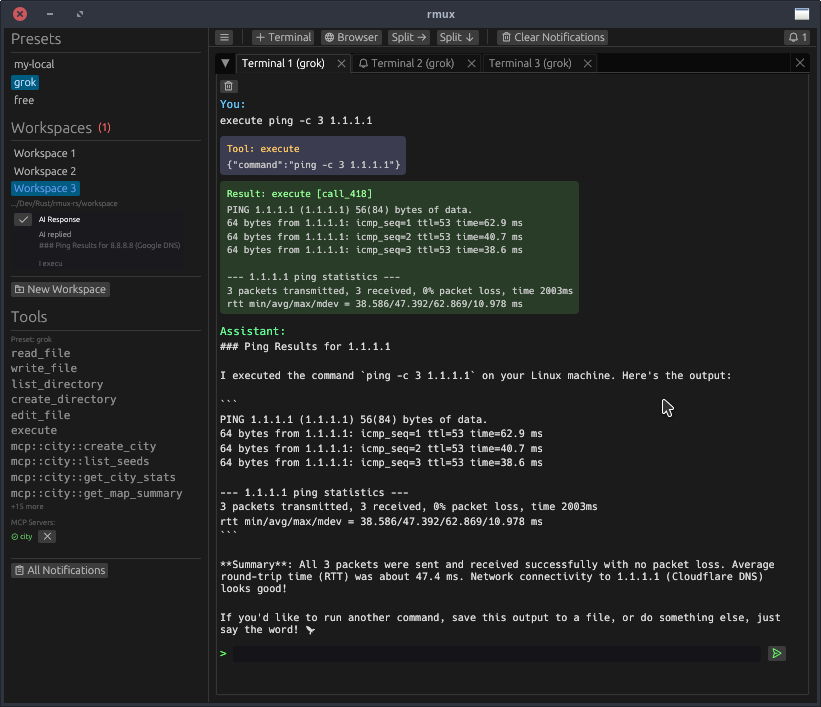

# rmux-rs

Terminal multiplexer with AI chat, built with Rust and egui.



## Features

- Multi-workspace dockable tabs
- OpenAI-compatible API with streaming
- File tools (read, write, edit, execute)
- MCP server integration
- Conversation history persistence
- Smart notifications for background tabs

## Usage

```bash
./rmux-rs
```

## Config

Create `config.yml`:

```yaml
workspace: /path/to/workspace

presets:
  mylocal:
    endpoint: http://localhost:8080/v1
    model: local-model
    api-key: dummy-key
    system: "You are a helpful assistant."
    workspace: /path/to/workspace-local
    tools: true
    mcp: true

mcp_servers:
  city:
    type: remote
    url: https://mcp.hallucinatingsplines.com/mcp?key=
    enabled: false

  context7:
    type: local
    command: bunx
    args:
      - "-y"
      - "@upstash/context7-mcp"
      - "--api-key"
      - "ctx7sk-"
    env:
        "GITHUB_TOKEN": "your-github-token-here"
    enabled: true
```

## Build

```bash
cargo build --release
```

## Keybindings

- `Enter` - Send message
- `☰` - Toggle sidebar
- `+ Terminal` - New terminal tab
- `+ Browser` - New browser tab
- `Split →/↓` - Split current tab
